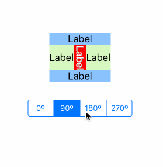
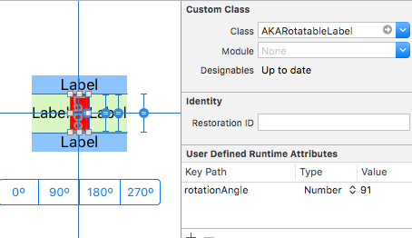
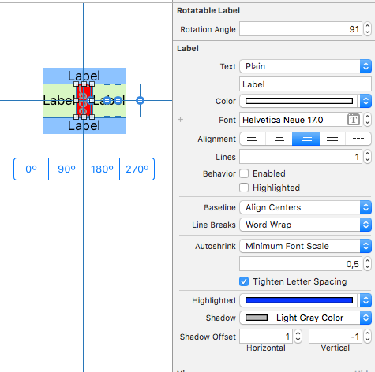

# AKA Rotatable Label

## What is does

AKARotatableLabel is a UILabel sub class that supports rotations at multiples of 90º.

It looks like this (Animations are jumpy due to framerate or the animated gif):

In interface builder:

and:

## How to install

For the moment, just clone the framework from Github or copy the AKARotatableLabel.[mh] files to your project. If I see that there is more than one user asking I'll make a pod.

## What works and what doesn't

### Angles

The label only supports angles which are multiples of 90ºs. Other values will be rounded to meet this requirement. 

### Autolayout

Works fine with autolayout, as long as the label's size is determined by it's intrinsic size. If you see problems, embed the label in a view and add &gt;= constraints (one or more for either horizontal and/or vertical sides), that should work fine.

### Animations

Changing the rotation angle inside animation blocks works fine (also in conjunction with constraints) in all cases covered in my use cases.

## How it works

I'm using two labels, the one that's actually rotated is a subview of the first.

The reason why I'm using a label and not a plain view as container is to support configuration of the label via interface builder (with a UIView and IBInspectable properties you can't configure fonts).

The reason why I'm using a container view in first place is because it seems to be impossible or at least too hard to make transformed views work properly with autolayout.

## Status

I only had the time to make the features work that I needed until now and also no time to write UI or unit tests. Will come back to this later.

The class will probably move to [AKACommons](https://github.com/mutech/aka-ios-commons)

## License

2-clause BSD, see LICENSE.txt
